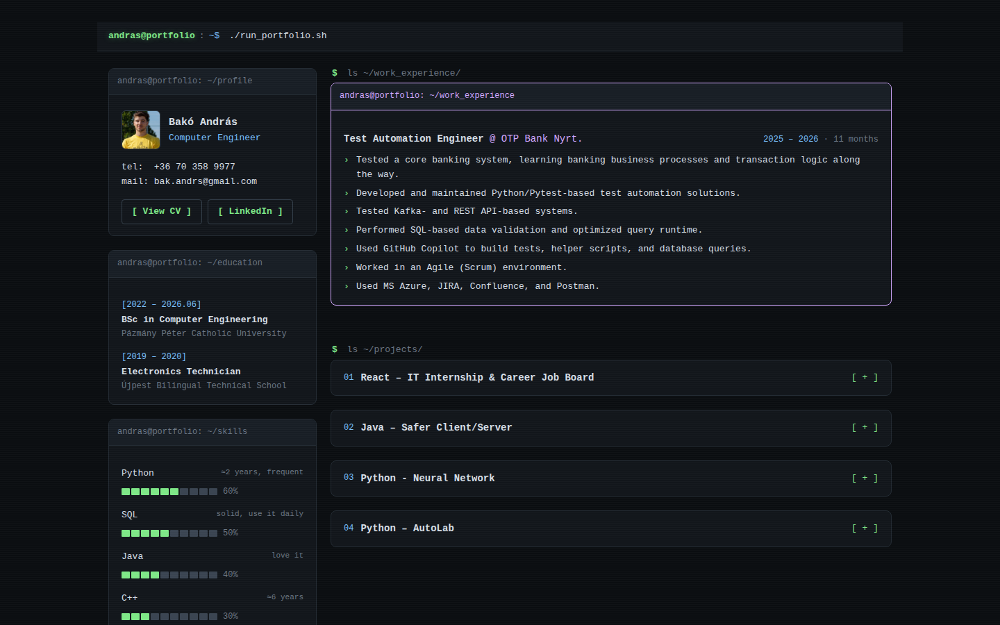
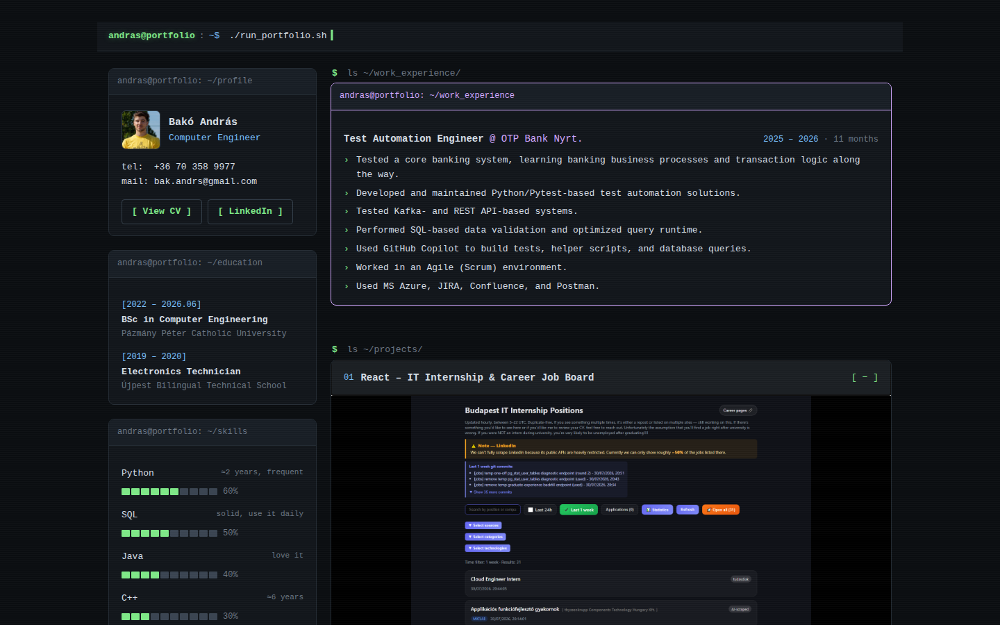
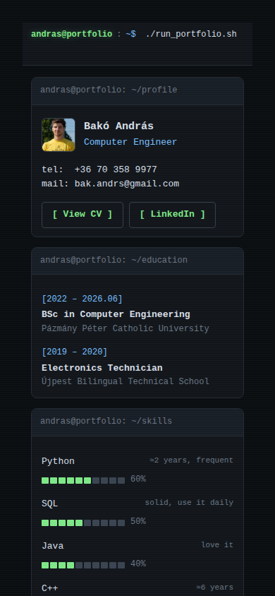

# Portfolio

My personal portfolio site, styled like a terminal session. It collects my work experience, education, skills and the projects I'm most proud of in one page.

## What's on it

- **Profile** – contact details, CV download and LinkedIn link
- **Work experience** – my Test Automation Engineer role at OTP Bank
- **Education & skills** – with a terminal-style progress bar for each skill
- **Projects** – each one expands into an image carousel with a short write-up, tags and links

### Featured projects

| # | Project | Stack |
|---|---|---|
| 01 | IT Internship & Career Job Board – hourly-updated aggregator of IT internships and junior jobs | React, Vite |
| 02 | [Safer Client/Server](https://github.com/Andrssss/JAVA_NAGYHF_okosabb_megoldas) – two-player networked game | Java, sockets, threads |
| 03 | Neural Network – competition project (top 5) | Python, PyTorch |
| 04 | [AutoLab](https://github.com/Andrssss/AutoLab) – low-cost lab automation on 3D-printer hardware, my thesis | Python, PyQt5, OpenCV, Arduino |

## Mobile

The layout collapses into a single column on small screens, and the carousels support swipe and dot navigation.

## Built with

- React 19 + Vite
- Plain CSS (no UI framework)
- Project images are picked up automatically from `src/assets/portfolio/works/<project>/` and preloaded on start
